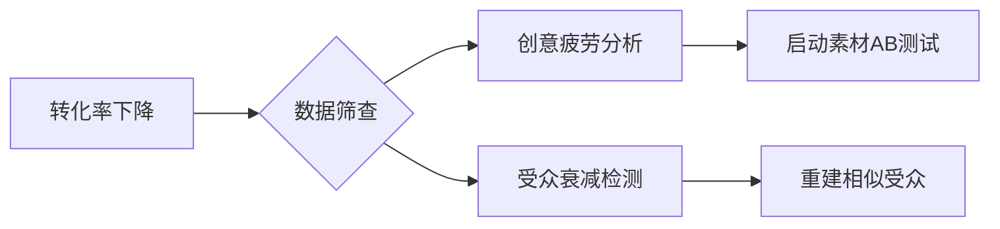

# Facebook广告运营优化指南

---

## 创意思路与素材测试方案
### 新素材验证流程
```step
1. 兴趣词筛选 → AI工具获取30组关键词
2. 素材排列组合 → 4种视觉形式交叉匹配
3. 对照组设置 → $45预算/72小时观测期
4. 效果评估 → 综合CTR和CPM双指标
```

### 兴趣词应用策略
| 兴趣类型 | 匹配方式           | 测试原则        | 优化周期   |
|----------|--------------------|-----------------|------------|
| 核心词   | 精准锁定产品属性   | 组合长尾词      | 每周更新   |
| 辅助词   | 关联消费场景       | 保持≥5组测试    | 每日调优   |
| 扩展词   | 泛兴趣领域覆盖     | 筛选CTR>1.8%词  | 随素材迭代 |

---

## 广告表现衰退应对策略
### 问题诊断指标


### 执行解决方案
| 问题阶段 | 处置措施             | 操作规范                | 响应时效   |
|----------|----------------------|-------------------------|------------|
| CPM突增  | 暂停当前投放         | 24:00后重启新组         | <4小时     |
| CTR下降  | 更换首帧视觉         | 测试3版差异化设计       | 8小时内    |
| 频次过高 | 排除高频展示用户     | 筛选7次以上曝光群体     | 每日核查   |
| 受众饱和 | 开发同类兴趣受众     | 新增3-5组定位维度       | 每周校准   |

---

## 精准定位优化方案
### 受众分层重建模型
| 群体类型       | 数据来源               | 定位策略               | 投放周期   |
|----------------|------------------------|------------------------|------------|
| 新潜力用户     | 相似受众扩展           | 动态兴趣组合           | 持续投放   |
| 深度互动用户   | 视频观看≥75%群体       | 精准商品推荐           | 30天       |
| 放弃购物车用户 | 加购未付款记录         | 折扣唤醒策略           | 7天        |
| 老客户召回     | 历史购买者（≥90天）    | 新品优先体验           | 季度性投放 |

---

## 再营销技术执行标准
### 自定义受众创建流程
```process
1. 数据源接入 → 安装Meta像素
2. 行为阈值设定 → 页面浏览≥3次
3. 过滤规则配置 → 排除近7天转化
4. 有效期设置 → 最长30天
5. 关联广告组 → 独立预算$50+
```

### 效果优化参数
| 追踪维度     | 标准值         | 调优手段                     |
|--------------|----------------|-----------------------------|
| 展现频次     | ≤5次/周       | 设置频次上限                |
| 响应时效     | <12小时        | 启用即时竞价策略            |
| 素材更换率   | ≥20%/周       | 预设3组备选方案             |
| 转化引导     | 强行动号召     | 倒计时+专享优惠组合         |

---

## 长效运营监测体系
### 核心健康指标
| 监测项目       | 安全阈值         | 维护措施                     |
|----------------|------------------|-----------------------------|
| 素材违规率     | <0.25%          | AI预审+人工复核双机制       |
| 账户存活周期   | ≥180天          | 定期资产迁移策略             |
| 预算偏差       | ≤基准值15%      | 动态补偿机制                |
| 域名安全性     | 无人工干预运行   | 自动404检测+流量牵引         |

> **操作建议**：每日9:00/15:00/21:00进行三次数据快照，每周五执行全域健康审计。广告组调整遵循72小时观察期原则，重大策略变更需保留3组对比试验。
> [教学视频](https://youtube.com/shorts/kohJCu1C3Qw?feature=share)
